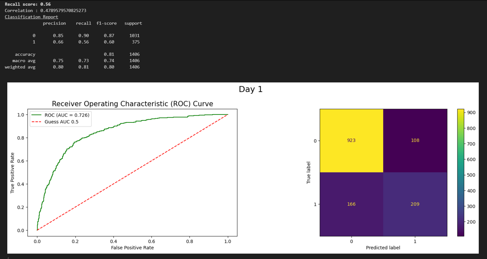
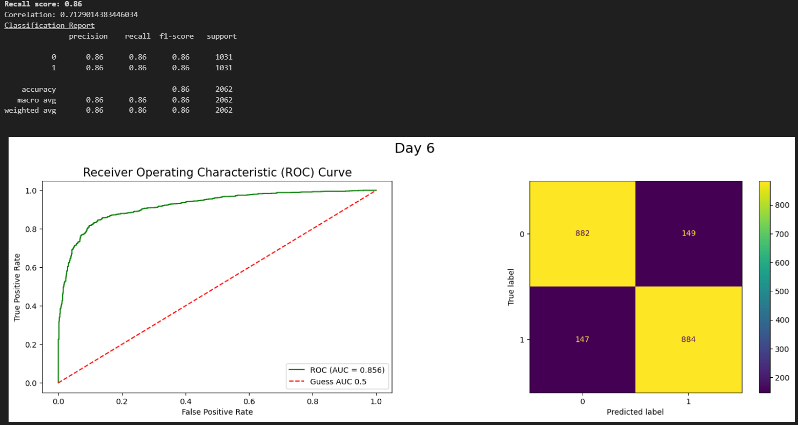

# Week 2: Predicting Customer Churn

## Objective
Our goal for Week 2 was to predict customer churn using various machine learning techniques. We focused on identifying churners with high recall and precision. Here's a summary of our journey from Day 1 to Day 7:

- **Day 1**: 
  * **Objective**: Preliminary data exploration, understanding the dataset's structure, preprocessing, and initial model training.
  * **Activities**:
    * General preprocessing of the dataset, including handling missing values and encoding categorical variables.
    * Basic exploratory data analysis (EDA) to understand data distributions and relationships.
    * Initial model training using traditional machine learning algorithms to establish a baseline.
  

- **Power bi Report**
    

- **Day 2**: 
  * **Objective**: Implement naive modeling techniques and feature selection.
  * **Activities**:
    * Dropped features with low Matthews correlation.
    * Performed Variance Inflation Factor (VIF) based feature selection to remove multicollinear features.
    * Simple modeling to establish a baseline performance with the selected features.

- **Day 3**: 
  * **Objective**: Feature engineering to improve model performance.
  * **Activities**:
    * Created new features using logic gates and combinations of existing features to capture more information.
    * Evaluated the impact of new features on model performance.

- **Day 4**: 
  * **Objective**: Address class imbalance using SMOTE-N (Synthetic Minority Over-sampling Technique for Nominal data).
  * **Activities**:
    * Applied SMOTE-N to balance the classes and improve the model's ability to predict churners.
    * Evaluated the impact of class balancing on model performance.

- **Day 5**: 
  * **Objective**: Perform error analysis and address decision boundary limitations.
  * **Activities**:
    * Conducted linear decision boundary analysis to identify model performance issues.
    * Introduced decision trees to overcome the limitations of linear decision boundaries.
    * Refined models based on error analysis results.

- **Day 6**: 
  * **Objective**: Enhance model performance using ensemble techniques.
  * **Activities**:
    * Implemented ensemble methods, including random forests and boosting techniques.
    * Compared model performance and selected the best-performing model.
  
  * **Results**: CatBoost emerged as the best model with 86% recall and 86% precision, and an AUC of 0.86 on the holdout set.

- **Day 7**: 
  * **Objective**: Utilize AutoML to streamline model selection and optimization.
  * **Activities**:
    * Leveraged AutoML libraries such as PyCaret and EvalML to automate model selection and hyperparameter tuning.
    * Compared AutoML results with manually trained models to validate performance.

## Summary
By systematically progressing through preprocessing, naive modeling, feature engineering, class balancing, error analysis, ensembling, and AutoML, we successfully developed a robust predictive model for customer churn estimation. The final model, CatBoost, achieved 86% recall and precision, making it highly effective at identifying churners.

This comprehensive approach ensured that we not only identified the most relevant features and addressed class imbalance but also optimized model performance through advanced techniques and automated tools.